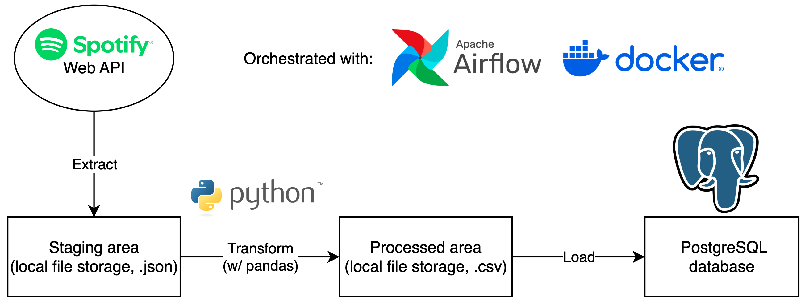
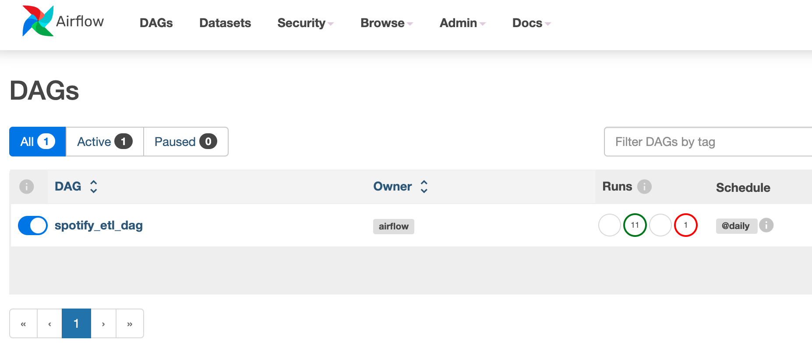
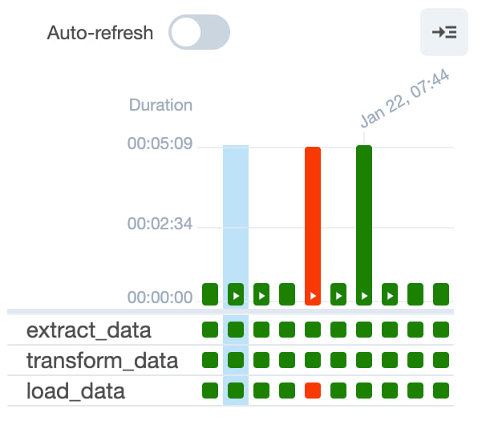

# Batch ETL pipeline for Spotify new releases
This project involves extracting new Spotify releases via Spotify's Web API and loading them into a PostgreSQL database:

## Core tech tools
- Python 3.10.14
- Spotify Web API
- PostgreSQL
- Apache Airflow
- Docker

## Pipeline explanation
1. **[Extract]** Raw data (new Spotify releases) is extracted from Spotify via their [Web API](https://developer.spotify.com/documentation/web-api) on a daily basis. Due to storage constraints, we extract only 50 releases for each day through pagination in `spotify_extractor.py`.
2. The raw data is stored as a json file in the local file storage in a directory designated as "staging area".
3. **[Transform]** The json file is then extracted from the staging area, cleaned, and transformed into a tabular format using pandas in `spotify_transformer.py`.
4. The cleaned data is stored as a csv file in the local file storage in a directory designated as "processed area".
5. **[Load]** Lastly, the script `spotify_loader.py` extracts the cleaned data from the processed area and loads it into a PostgreSQL database.

The entire workflow is orchestrated by Airflow to run on a daily basis. Docker is also used to create the Airflow instance. The template for the `docker-compose.yaml` file can be found [here](https://airflow.apache.org/docs/apache-airflow/stable/howto/docker-compose/index.html#fetching-docker-compose-yaml).

## How to get started

1. Clone this repoistory
2. Install Docker
3. [Sign up for a Spotify dev account](https://developer.spotify.com/documentation/web-api) and obtain your `Client ID` and `Secret ID` `env` variables. Update the hidden `dags/scripts/.env` file with the values.
4. Run `docker-compose up` in the root directory
5. Go to http://localhost:8080/ and login with `airflow` as the user and password.

If everything works correctly, the following page should be displayed:

Clicking into the DAG should reveal the DAG's tasks:

## Future potential improvements
As this is my first personal DE project, I feel there are several areas for improvement. In no particular order:

- **Using cloud tools like AWS**:
   - **Why**: Cloud tools are much more scalable, accessible, and reliable then simply using local file storage. It would also allow for easier integration with other cloud tools in future. 
   
- **Move scripts into separate `/scripts` folder outside of `/dags`**:
   - **Why**: Moving the ETL scripts into a dedicated `scripts/` folder would improve the organisation of files and the entire project. I am currently unable to make it work as moving the files into such a folder would lead to Airflow being unable to access the files for some reason.

- **Using Airflow variables for dates**:
   - **Why**: Using Airflow variables to replace the hardcoded `datetime.now()` would make the DAG re-runnable for past dates. Backfilling can be easily done if the need arises.
   